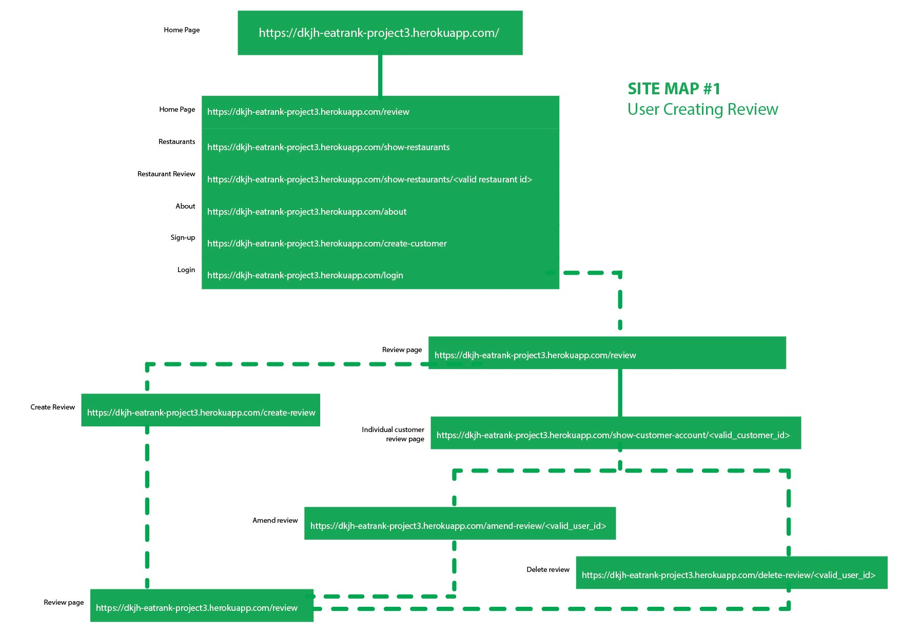
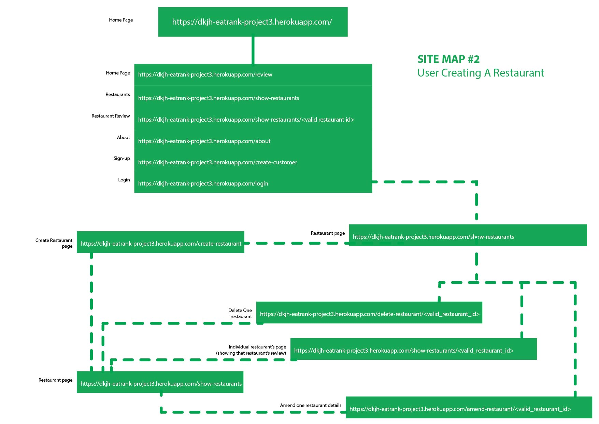
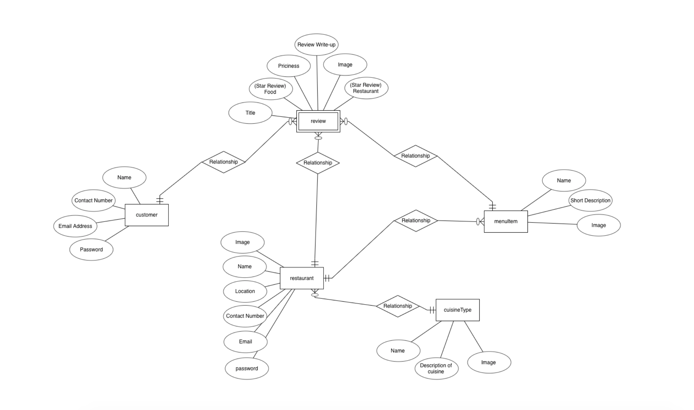
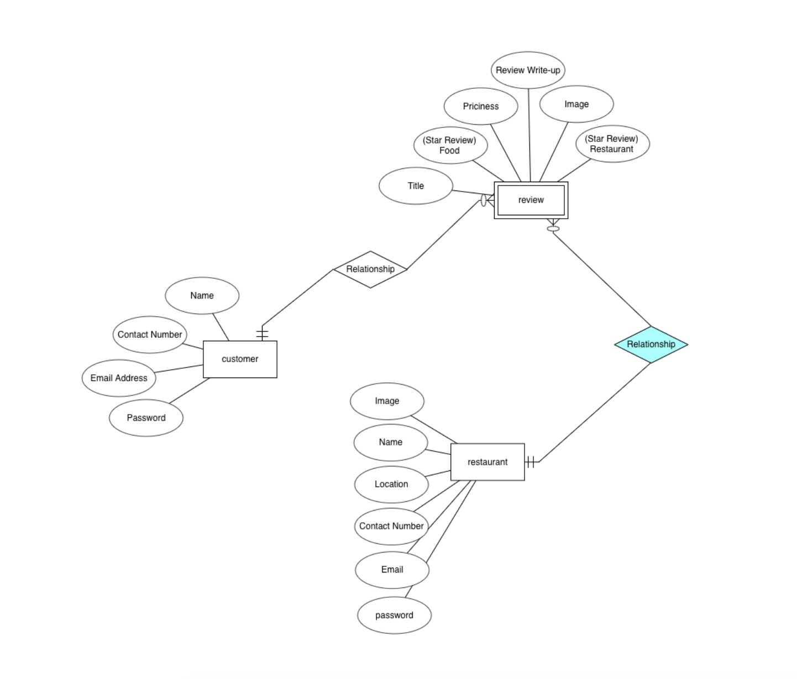

# EatRank | We can't get enough of reviews 

## Introduction 
EatRank is a crowd-source food review website that selects genuine customers from a community of food enthusiast to help review various restaurants in Singapore. The platform aims to moderate between the consumer’s need for credible information while balancing the anonymity of the internet which most famous reviews platform fail to moderate.

At this current stage, the idea for the platform is to have EatRank employees add partner restaurants into our platform while reviewers are verified offline via a 1-day training programme on how to utilise the platform. 

The platform aims to generate revenue from a small platform fee from restaurants and advertisements by “bumping” listings to the top of the page. 

## Demo
### You may test the current working page at: 
    https://dkjh-eatrank-project3.herokuapp.com/

### To log-in, please use: 
    Email: pg1964@gmail.com
    Password: polarbear1234

## UI/UX 

### Strategy

#### __Owner Goals__
The site owner aims to use the platform to on-board partner restaurants and encourage more user sign ups. To that end, the initial phase of EatRank will allow verified users to create restaurants themselves by adding in places they have visited and wish to list on EatRank. This is to prove that the concept works and gather initial traffic to the site with an adequate number of restaurant listed.
However, this feature will be temporary and closely monitored by the Team to ensure there is no exploitation of this feature. In future, restaurants can only be added by EatRank staff.

#### __User Goals__

##### Scope 
__App features for members of the public:__
1.	A page to show all restaurants with an option to see each individual restaurant’s review. 
2.	A page to browse all reviews in the EatRank database
3.	A page to login

__App features for EatRank Community Members:__ 
1.	Log-in page 
2.	Individual review page to create/update/delete reviews made by the community member 
3.	Restaurant page to create/update/delete restaurants. 

##### User Story
For the public, they may browse (or search) for the restaurant they intend to patronise and read up on the reviews before heading down. This is done primarily on the “Restaurants” page where they may click on the review button beneath each restaurant to read the reviews.

For the public who like to read reviews casually, the “Review” page offers all the reviews, the reviewer, the rating as well as the restaurant name. This is designed for members of the public to browse and try out new places with interesting reviews. 

For community members, after logging in, they may edit their reviews by clicking on their name on the “Review” page which displays all the reviews within the EatRank database. 

Community members (upon logging in) may delete, edit or create new restaurants they visited. As mentioned in the introduction, this function is temporary.

##### Unavailable features to be implemented soon
1.	__Hashing of password.__ Currently, passwords are stored as a string in MongoDB. This feature will be done before going live. 
2.	__User/Password validation.__ Currently, there is no restrictions/limit to what a new community member can input to create an account. Technically, a new user may leave all the fields empty to sign up for EatRank. This shouldn’t be the case. For future development, validation will be included to ensure such discrepancies do not occur. 
3.	__User edit & profile picture page.__ Customisation of a user profile is a good feature to increase a community user’s ownership and commitment to the platform. Future development will include this feature where any logging in will be able to add a profile picture, a short-description and the date they joined EatRank. 
4.	__Lack of date for each review.__ This is an error discovered before submission. Date & timestamp should have been included for each review.
5.	__Bootstrap -md mosaic template error.__ One bug found during testing was the lack of responsiveness for -md for the mosaic function on the “Review” page displaying all reviews. Further investigation is warranted. Current research did not yield any results on the cause of this error.
6.	__Refined restaurant search & tag.__ One feature that was suggested but lacked the time to implement was a more refined search for restaurants. Future updates will include a “#” function for each restaurant so community users may create or follow tag trends and display those trends to the public. Restaurant may also be segmented base on their cuisine type (e.g. Japanese, Local, Fusion, Fine-Dining…) 
7.	__Footer sitemap.__ UX wise, a site map for the footer will be included in future updates. 

### Structure
#### Site Map 

__Site Map #1 | User Creating a Review__
If users are logged in as a community member, they are able to follow this process to create a review. 

__Site Map #2 | User Creating a Restaurant__
Currently, if users would like to create a restaurant, they may follow this sitemap to create a restaurant.

### Skeleton

### Surface
•	__Color:__ Grab Singapore (a ride hailing & food-delivery app) heavily inspired this design. Green is palatable and evokes a sense of growth, community and nature, a ode to the organic strategy the platform wants to take to grow it’s community. 

•	__Font:__ San Serif was used to evoke a modern feel. Font used was “Helvetica Neue” provided by Bootstrap. Helvetica is great for a clean interface and the lack of a font-tail distance EatRank from the gaudiness and pomp. 

•	__Layout:__ The site adopted a clean, hierarchical set up with a navbar consistent throughout all pages. A green background emphasizes the brand’s colour and contrast well for input forms. 

•	__Images:__ The index page’s images were selected for their white and hints of green in the image. All images were taken from Freepik Premium Account where attribution are not required.

## Technologies used
•	HTML5

•	CSS3

•	Python 2.7.5

•	Javascript (for dependencies like Toastr & Bootstrap. No code was written in Javascript for this project)

•   Bootstrap 4.0

•   Toastr (to be implemented in future, dependecy installed)

•	Mongo Atlas 4.4

•	Cloudinary 1.22.0 

•	Flask 1.1.2

•	Flask-Login 0.5.0

•	Gunicorn 20.0.4 

•	Heroku

### Programming Methodology 
For security purposes, .env file was used together with gitignore in my working environment so that Mongo Secret and Cloudinary Secret are not pushed to GitHub.

While this project only involved myself (Daryl), I used GitHub for source control for any day-to-day commit. Commits to Heroku were done at the beginning as a test and, subsequently, nearing the deadline of the project. 

## Database Design 
E.R. Diagram at the beginning of the project 13 August 2020

E.R. Diagram at the end of the project 04 September 2020

After consulting and examination of the database, it was found to be pointless to include a MenuItems database as of now. The reason being that MenuItems are inconsistent and requires the input of restaurant owners/management to input menu items manually. This is time consuming and pointless at this stage and does not gel with the purpose of EatRank which primarily serves to deliver quality reviews to it's users.

Cuisine type was also removed due to the lack of time to implement the feature. It would require a separate database as future menuItems may be stored under an array in the various Cuisine Type.

## Testing 

## Deployment 
### To deploy on Heroku

1. Download or Clone the master branch from github

2. To list all the requirements in requirements.txt, run the following command in terminal:
    > pip3 freeze --local > requirements.txt

3. Set Debug to False
4. Procfile need to be created to run gunicorn upon deployment

5. Git push to Heroku Master after all the documents are properly set up

6. All public keys and private keys for the following need to be added to in Heroku Config Vars settings:

    >Cloudinary API
    >MongoDB URI
    >Dabatase Name | EatRank

## Credits 
1. __Freepik Premium Content Provider:__ Much of this project relied on Freepik image provider for the hi-res images on the beginning of the page 
2. __GetBootstrap.com:__ Bootstrap 4.0 was used for much of the layout for the flexbox & styling of individual reviews/restaurants,login pages and icons (did not rely on fontAwesome for this project).
3. __Paul Chor:__ Provided the boiler plate template for Flask and mentorship for the whole of the project's life-cycle.

### Image Mock-Up credits for restaurant images: 
• [The Culture Trip](https://theculturetrip.com/asia/singapore/articles/the-5-best-rooftop-restaurants-in-singapore/)

• [Time Out Singapore](https://www.timeout.com/singapore/restaurants/restaurants-with-best-views-of-singapore)

• [CNT Traveller](https://www.cntraveler.com/gallery/best-restaurants-in-singapore)

• [Time Out Singapore](https://www.timeout.com/singapore/restaurants/most-instagrammable-cafes-in-singapore)

• [DiscoverSG](https://discoversg.com/2017/01/16/fancy-cafes-singapore/)

• [Burple | Review By: Khaw Han Chung](https://www.burpple.com/dishes/1055699/sumo-ramen)

