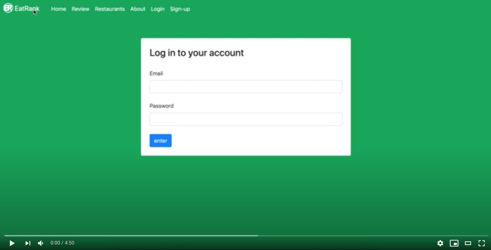
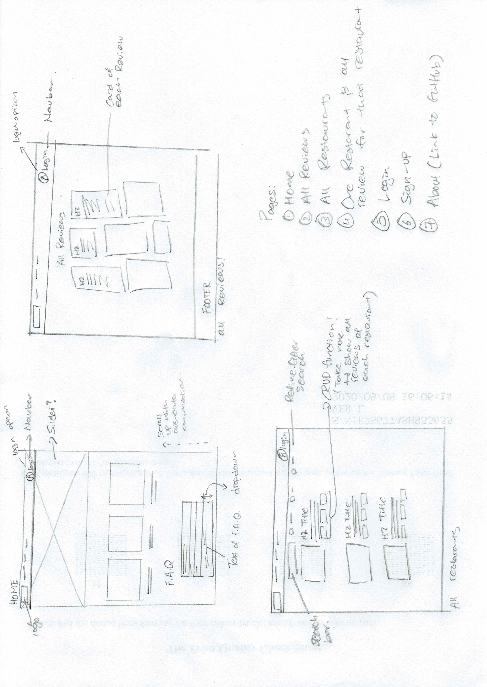
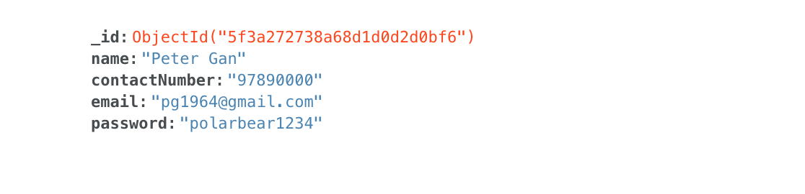
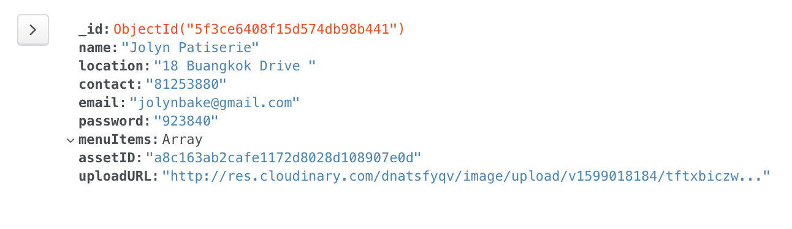
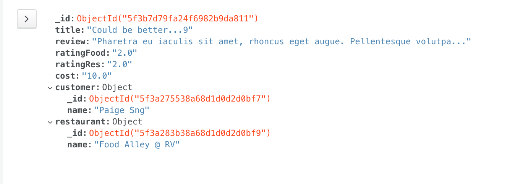

# EatRank | We can't get enough of reviews 

## Introduction 
EatRank is a crowd-source food review website that selects genuine customers from a community of food enthusiast to help review various restaurants in Singapore. The platform aims to moderate between the consumer’s need for credible information while balancing the anonymity of the internet which most famous reviews platform fail to moderate.

At this current stage, the idea for the platform is to have EatRank employees add partner restaurants into our platform while reviewers are verified offline via a 1-day training programme on how to utilise the platform. 

The platform aims to generate revenue from a small platform fee from restaurants and advertisements by “bumping” listings to the top of the page. 

## Demo
### You may test the current working page at: 
    https://dkjh-eatrank-project3.herokuapp.com/

### To log-in, please use: 
    Email: pg1964@gmail.com
    Password: polarbear1234

## UI/UX 


### Strategy

#### __Owner Goals__
The site owner aims to use the platform to on-board partner restaurants and encourage more user sign ups. To that end, the initial phase of EatRank will allow verified users to create restaurants themselves by adding in places they have visited and wish to list on EatRank. This is to prove that the concept works and gather initial traffic to the site with an adequate number of restaurant listed.
However, this feature will be temporary and closely monitored by the Team to ensure there is no exploitation of this feature. In future, restaurants can only be added by EatRank staff.

#### __User Goals__

##### Scope 
__App features for members of the public:__
1.	A page to show all restaurants with an option to see each individual restaurant’s review. 
2.	A page to browse all reviews in the EatRank database
3.	A page to login

__App features for EatRank Community Members:__ 
1.	Log-in page 
2.	Individual review page to create/update/delete reviews made by the community member 
3.	Restaurant page to create/update/delete restaurants. 

##### User Story
For the public, they may browse (or search) for the restaurant they intend to patronise and read up on the reviews before heading down. This is done primarily on the “Restaurants” page where they may click on the review button beneath each restaurant to read the reviews.

For the public who like to read reviews casually, the “Review” page offers all the reviews, the reviewer, the rating as well as the restaurant name. This is designed for members of the public to browse and try out new places with interesting reviews. 

For community members, after logging in, they may edit their reviews by clicking on their name on the “Review” page which displays all the reviews within the EatRank database. 

Community members (upon logging in) may delete, edit or create new restaurants they visited. As mentioned in the introduction, this function is temporary.

##### Unavailable features to be implemented soon
1.	__Hashing of password.__ Currently, passwords are stored as a string in MongoDB. This feature will be done before going live. 
2.	__User/Password validation.__ Currently, there is no restrictions/limit to what a new community member can input to create an account. Technically, a new user may leave all the fields empty to sign up for EatRank. This shouldn’t be the case. For future development, validation will be included to ensure such discrepancies do not occur. 
3.	__User edit & profile picture page.__ Customisation of a user profile is a good feature to increase a community user’s ownership and commitment to the platform. Future development will include this feature where any logging in will be able to add a profile picture, a short-description and the date they joined EatRank. 
4.	__Lack of date for each review.__ This is an error discovered before submission. Date & timestamp should have been included for each review.
5.	__Bootstrap -md mosaic template error.__ One bug found during testing was the lack of responsiveness for -md for the mosaic function on the “Review” page displaying all reviews. Further investigation is warranted. Current research did not yield any results on the cause of this error.
6.	__Refined restaurant search & tag.__ One feature that was suggested but lacked the time to implement was a more refined search for restaurants. Future updates will include a “#” function for each restaurant so community users may create or follow tag trends and display those trends to the public. Restaurant may also be segmented base on their cuisine type (e.g. Japanese, Local, Fusion, Fine-Dining…) 
7.	__Footer sitemap.__ UX wise, a site map for the footer will be included in future updates. 


### Structure
#### Site Map 

For a visual walkthrough of the website, you may view the video below: 
[](https://www.youtube.com/watch?v=qCnM95VPwss&feature=youtu.be)

__Site Map #1 | User Creating a Review__
If users are logged in as a community member, they are able to follow this process to create a review. 


__Site Map #2 | User Creating a Restaurant__
Currently, if users would like to create a restaurant, they may follow this sitemap to create a restaurant.


### Skeleton
Wireframing was done on a piece of paper and ideated with the features to be included. An about us page was considered for direct linking to GitHub for future employers to peruse the project details with ease and to avoid any confusion that EatRank is a live site ready-to-be-used.


### Surface

•	__Color:__ Grab Singapore (a ride hailing & food-delivery app) heavily inspired this design. Green is palatable and evokes a sense of growth, community and nature, a ode to the organic strategy the platform wants to take to grow it’s community. 

•	__Font:__ San Serif was used to evoke a modern feel. Font used was “Helvetica Neue” provided by Bootstrap. Helvetica is great for a clean interface and the lack of a font-tail distance EatRank from the gaudiness and pomp. 

•	__Layout:__ The site adopted a clean, hierarchical set up with a navbar consistent throughout all pages. A green background emphasizes the brand’s colour and contrast well for input forms. 

•	__Images:__ The index page’s images were selected for their white and hints of green in the image. All images were taken from Freepik Premium Account where attribution are not required.

## Technologies used
•	HTML5

•	CSS3

•	Python 2.7.5

•	Javascript (for dependencies like Toastr & Bootstrap. No code was written in Javascript for this project)

•   Bootstrap 4.0

•   Toastr (to be implemented in future, dependecy installed)

•	Mongo Atlas 4.4

•	Cloudinary 1.22.0 

•	Flask 1.1.2

•	Flask-Login 0.5.0

•	Gunicorn 20.0.4 

•	Heroku

### Programming Methodology 
For security purposes, .env file was used together with gitignore in my working environment so that Mongo Secret and Cloudinary Secret are not pushed to GitHub.

While this project only involved myself (Daryl), I used GitHub for source control for any day-to-day commit. Commits to Heroku were done at the beginning as a test and, subsequently, nearing the deadline of the project. 

## Database Design 
Due to the simplicity of relationship between various entities, MongoDB was used for it's scalability and the infancy of this project. It is a plan, if criterions/features are confirmed and stable, for this platform to adopt SQL database which will help with enforcing relationships between data strictly as compared to MongoDB. 

E.R. Diagram at the beginning of the project 13 August 2020


E.R. Diagram at the end of the project 04 September 2020


After consulting and examination of the database, it was found to be pointless to include a MenuItems database as of now. The reason being that MenuItems are inconsistent and requires the input of restaurant owners/management to input menu items manually. This is time consuming and pointless at this stage and does not gel with the purpose of EatRank which primarily serves to deliver quality reviews to it's users.

Cuisine type was also removed due to the lack of time to implement the feature. It would require a separate database as future menuItems may be stored under an array in the various Cuisine Type.

### Database relationships

1. __Restaurants & Reviews| Many-to-many relationship__
One restaurant may contain many reviews. This is the main purpose of the application to show the reviews related to the individual restaurants. The database strategy here is to use a reference as one ID can have many reviews and inserting duplicate reviews in the review database and the restaurant will only cause the restaurant to contain a wide list of array of reviews. However, the individual restaurant is embedded into the review it is for as a reference.  

2. __Individuals & Reviews| Many-to-many relationship__
Similar to the restaurant, a reference methodology was employed so that we avoid a large array/dictionary of items/objects. 

## Mongo Sample documents 
__Customer__


__Restaurant__


__review__



## Testing 

### Test for logging in 
| Step | Description            | Expected Outcomes                                                                    |
|------|------------------------|--------------------------------------------------------------------------------------|
| 1    | Click on Sign-up       | https://dkjh-eatrank-project3.herokuapp.com/create-customer should load              |
| 2    | Enter your name        | Must be unique to the database with no special characters. If not, validation error. |
| 3    | Enter your contact     | Must contain 8-digit with no country code, special characters & alphabets.           |
| 4    | Enter your email       | Email must include a "@" character.                                                  |
| 5    | Enter desired password | Must be 8 characters long.                                                           |
| 6    | Click submit           | Page should load https://dkjh-eatrank-project3.herokuapp.com/review with a greeting! |

Once logged in, the following test below can take place. Else, these functions will not be available to those who did not log in or create an account with EatRank. 

### Test for CRUD Log-in features below:
### Test for creating restaurant
| Step  | Description               | Expected Outcomes                                                                                                                                                 |
|-------|---------------------------|-------------------------------------------------------------------------------------------------------------------------------------------------------------------|
| 1     | Click on add restaurant   | https://dkjh-eatrank-project3.herokuapp.com/create-restaurantshould load                                                                                          |
| 2     | Enter the Restaurant name | Must be unique to the database (to be validated with Regex to ensure similar names with different cases/name conventions are accepted). If not, validation error. |
| 3     | Enter the Location        | Must have more than 2 characters                                                                                                                                  |
| 4     | Enter the Contact         | Must contain 8-digit with no country code, special characters & alphabets.                                                                                        |
| 5     | Enter Email               | Email must include a "@" character.                                                                                                                               |
| 6     | Upload a image            | Cloudinary will appear and prompt user to upload an image of the restaurant                                                                                       |
| 7     | Click on create           | User will be brought to https://dkjh-eatrank-project3.herokuapp.com/show-restaurants. Latest addition will appear at the bottom of the page.                      |                                                                                                                        |

### Test for editing restaurant
| Step  | Description                              | Expected Outcomes                                                                                                                                                 |
|-------|------------------------------------------|-------------------------------------------------------------------------------------------------------------------------------------------------------------------|
| 1     | Click on one restaurant you wish to edit | https://dkjh-eatrank-project3.herokuapp.com/amend-restaurant/valid-user-id will load                                                                            |
| 2     | Edit the Restaurant name                 | Must be unique to the database (to be validated with Regex to ensure similar names with different cases/name conventions are accepted). If not, validation error. |
| 3     | Edit the Location                        | Must have more than 2 characters                                                                                                                                  |
| 4     | Edit the Contact                         | Must contain 8-digit with no country code, special characters & alphabets.                                                                                        |
| 5     | Edit Email                               | Email must include a "@" character.                                                                                                                               |
| 6     | Edit an image                            | Cloudinary will appear and prompt user to upload an image of the restaurant                                                                                       |
| 7     | Click on submit                          | User will be brought to https://dkjh-eatrank-project3.herokuapp.com/show-restaurants. Edits will appear according to the post edited.                             |

### Test for delete restaurant
| Step  | Description                                | Expected Outcomes                                                                                                              |
|-------|--------------------------------------------|--------------------------------------------------------------------------------------------------------------------------------|
| 1     | Click on one restaurant you wish to delete | https://dkjh-eatrank-project3.herokuapp.com/delete-restaurant/valid-restaurant-id route will load                            |
| 2     | If you click "Yes, Delete"                 | You will be taken back to  https://dkjh-eatrank-project3.herokuapp.com/show-restaurants with the deleted restaurant entry gone |
| 3     | If you click "No"                          | You will be taken back to https://dkjh-eatrank-project3.herokuapp.com/show-restaurants                                         |

### Test for searching of restaurant
| Step | Description                                                        | Expected Outcomes                                                                        |
|------|--------------------------------------------------------------------|------------------------------------------------------------------------------------------|
| 1    | Visit https://dkjh-eatrank-project3.herokuapp.com/show-restaurants | Page will display all restaurants and a search bar on the top of all restaurant listings |
| 2    | Entered letter "A" into the search bar & clicked on search         | All listings with A in it's name appears                                                 |
| 3    | Entered letter "1" into the search bar & clicked on search         | No listing appeared as no titles contained the number "1"                                |
| 4    | Entered string "sumo" into the search bar & clicked on search      | "The Great Sumo Ramen" appeared as it contains the word Sumo.                            |
| 5    | Entered a empty search in into the search bar & clicked on search  | All listing appear as it is restaurant.find() in the database.                           |

### Test for creating reviews
| Step  | Description                            | Expected Outcomes                                                                                                                 |
|-------|----------------------------------------|-----------------------------------------------------------------------------------------------------------------------------------|
| 1     | Visit '/review' route                  | "Hello <user-name>! Would you like to contribute" will show on the top left of the page                                           |
| 2     | Click on "Contribute" link             | https://dkjh-eatrank-project3.herokuapp.com/create-review will load to prompt user to write a review                              |
| 3     | Select the restaurant from a drop menu | User will see a drop down menu of all the restaurant in the database                                                              |
| 4     | Enter a title                          | User will enter a title. It cannot be left blank.                                                                                 |
| 5     | Enter a review                         | User will enter a review. It cannot be left blank.                                                                                |
| 6     | Use the slider to rate the food        | User will be able to slide right for a higher rating and left for a lower rating shown by a thumbs up and down icon on both ends. |
| 7     | Use the slider to rate the restaurant  | User will be able to slide right for a higher rating and left for a lower rating shown by a thumbs up and down icon on both ends. |
| 8     | Use the slider to rate the cost        | User will be able to slide right for a higher rating and left for a lower rating shown by a thumbs up and down icon on both ends. |
| 9     | Click on create to create a review     | https://dkjh-eatrank-project3.herokuapp.com/review will load to show the latest reviews in the tiles (going from left-right)      |

### Test for created reviews in individual restaurants
| Step | Description                                                                  | Expected Outcomes                                                                                                                       |
|------|------------------------------------------------------------------------------|-----------------------------------------------------------------------------------------------------------------------------------------|
| 1    | Visit the route https://dkjh-eatrank-project3.herokuapp.com/show-restaurants | Page will display all restaurants                                                                                                       |
| 2    | Select the restaurant you just left a review for                             | https://dkjh-eatrank-project3.herokuapp.com/show-restaurants/valid-restaurant-id will load showing all the reviews for the restaurant |

### Test for editing reviews
| Step  | Description                                                                  | Expected Outcomes                                                                                                                        |
|-------|------------------------------------------------------------------------------|------------------------------------------------------------------------------------------------------------------------------------------|
| 1     | Visit '/review' route                                                        | "Hello user-name! Would you like to contribute" will show on the top left of the page                                                  |
| 2     | Click on "<user-name>" link. The user's registered name should be shown here | https://dkjh-eatrank-project3.herokuapp.com/show-customer-account/valid-user-id will load to show all the review the user has written. |
| 3     | Choose the review to edit                                                    | https://dkjh-eatrank-project3.herokuapp.com/amend-review/valid-review-id will load to show the selected review and the past reviews    |
| 4     | Drop down menu will be empty                                                 | User does not need to select a restaurant here.                                                                                          |
| 5     | User may edit the title                                                      | User will may edit the title. It cannot be left blank.                                                                                   |
| 6     | User may edit the review                                                     | User may edit the review. It cannot be left blank.                                                                                       |
| 7     | User may edit the Food Rating by repositioning the slider                    | User will be able to slide right for a higher rating and left for a lower rating shown by a thumbs up and down icon on both ends.        |
| 8     | User may edit the Restaurant Rating by repositioning the slider              | User will be able to slide right for a higher rating and left for a lower rating shown by a thumbs up and down icon on both ends.        |
| 9     | User may edit the Cost Rating by repositioning the slider                    | User will be able to slide right for a higher rating and left for a lower rating shown by a thumbs up and down icon on both ends.        |
| 10    | Click on submit                                                              | https://dkjh-eatrank-project3.herokuapp.com/review will load to show the latest reviews in the tiles (going from left-right)             |

### Test for delete reviews
| Step  | Description                                                                  | Expected Outcomes                                                                                                                        |
|-------|------------------------------------------------------------------------------|------------------------------------------------------------------------------------------------------------------------------------------|
| 1     | Visit '/review' route                                                        | "Hello user-name! Would you like to contribute" will show on the top left of the page                                                  |
| 2     | Click on "user-name" link. The user's registered name should be shown here | https://dkjh-eatrank-project3.herokuapp.com/show-customer-account/valid-user-id will load to show all the review the user has written. |
| 3     | Choose the review to delete                                                  | https://dkjh-eatrank-project3.herokuapp.com/delete-review/valid-review-id will load to caution deletion for the selected review.       |
| 4     | If you click "Yes, Delete"                                                   | You will be taken back to https://dkjh-eatrank-project3.herokuapp.com/review with the deleted restaurant entry gone                      |
| 5     | If you click "No"                                                            | You will be taken back to https://dkjh-eatrank-project3.herokuapp.com/review                                                             |

### Test for logging out 
| Step | Description                      | Expected Outcomes                                                                                                                                                       |
|------|----------------------------------|-------------------------------------------------------------------------------------------------------------------------------------------------------------------------|
| 1    | Click on 'Logout' on the NavBar  | https://dkjh-eatrank-project3.herokuapp.com/login will load indicating successful logout                                                                                |
| 2    | Visit 'Review' on the NavBar     | https://dkjh-eatrank-project3.herokuapp.com/review will load with the absence of the individual login missing. User us prompted to either login or create a new account |
| 3    | Visit 'Restarants' on the NavBar | https://dkjh-eatrank-project3.herokuapp.com/show-restaurants will load with the absence of delete or edit available for the user to do both actions until they log in   |


** The current validation here are missing due to limited time. Future implementation will include validation to ensure input keyed in are as specified for testing.

## Deployment 
### To deploy on Heroku

1. Download or Clone the master branch from github

2. To list all the requirements in requirements.txt, run the following command in terminal:
    ```
     pip3 freeze --local > requirements.txt
    ````
3. Set Debug to False
4. Procfile need to be created to run gunicorn upon deployment

5. Git push to Heroku Master after all the documents are properly set up

6. All public keys and private keys for the following need to be added to in Heroku Config Vars settings:

    > MongoDB URI
    > MongoDB Secret Key
    > Dabatase Name : EatRank
    > Cloudinary Upload Preset
    > Cloudinary Cloud Name


## Credits 
1. __Freepik Premium Content Provider:__ Much of this project relied on Freepik image provider for the hi-res images on the beginning of the page. As the account used is premium, no attribution was required and it is free to use.
2. __GetBootstrap.com:__ Bootstrap 4.0 was used for much of the layout for the flexbox & styling of individual reviews/restaurants,login pages and icons (did not rely on fontAwesome for this project).
3. __Paul Chor:__ Provided the boiler plate template for Flask and mentorship for the whole of the project's life-cycle.

### Image Mock-Up credits for restaurant images: 
• [The Culture Trip](https://theculturetrip.com/asia/singapore/articles/the-5-best-rooftop-restaurants-in-singapore/)

• [Time Out Singapore](https://www.timeout.com/singapore/restaurants/restaurants-with-best-views-of-singapore)

• [CNT Traveller](https://www.cntraveler.com/gallery/best-restaurants-in-singapore)

• [Time Out Singapore](https://www.timeout.com/singapore/restaurants/most-instagrammable-cafes-in-singapore)

• [DiscoverSG](https://discoversg.com/2017/01/16/fancy-cafes-singapore/)

• [Burple | Review By: Khaw Han Chung](https://www.burpple.com/dishes/1055699/sumo-ramen)


